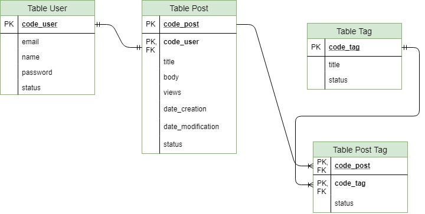

# Informations the Database
The SGBD used was [PostgreSQL](https://www.postgresql.org/) (version 9.6) and the [node-postgres](https://node-postgres.com/) driver was used to access it.

**Entity diagram and relationship:**

To access the **data dictionary**, click [here](./DATA_DICTIONARY.md) :book:

To access SQL from the database, click [here](../../db/init.sql).